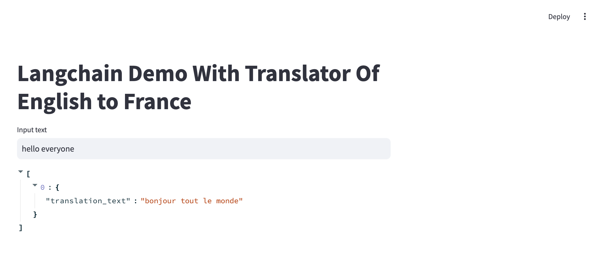

# NER_TokenClassifier

   

## Introduction

This is finetuning model of MarianMT to handle TRANSLATOR task from NLP.

## Description

Dataset: `*kde4*`

Language: `*pytorch*`

## Notes:

`data_train.py`: represent the dataset

`preprocessing.py`: tokenizer dataset, align inputs and labels after tokenized that occur changed length of sentences.

`train.py`: train model

`predictor.py`: inference model

`config.py`: hyperparameter config

## How to use

1. Training:

`python3 train.py`

2. Inference:

`python3 predictor.py`

3. Pipeline for Streamlit Deployment

`streamlit run main.py`
